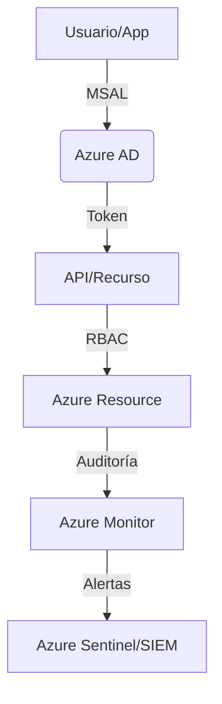
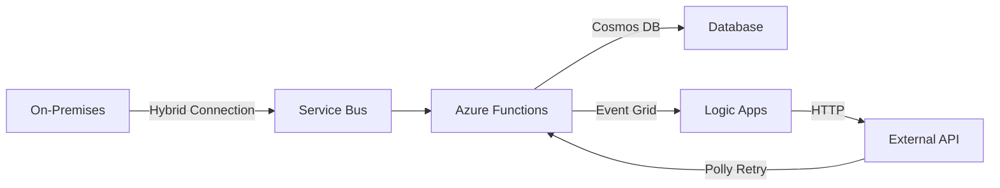

# Resumen para el Examen AZ-204: Desarrollo de Soluciones en Azure

## 1. Develop Azure compute solutions (25–30%)

### Azure Functions

**Definición clave**: Servicio serverless que ejecuta código en respuesta a eventos sin administrar infraestructura.

**Tabla comparativa de triggers**:

| Trigger | Escenario típico | Configuración en C# |
|---------|------------------|---------------------|
| HTTP | APIs REST | `[HttpTrigger(AuthorizationLevel.Function, "post")]` |
| Blob | Procesar archivos al subirse | `[BlobTrigger("container/{name}")]` |
| Queue | Procesamiento asíncrono | `[QueueTrigger("myqueue")]` |

**Fragmento de código para HTTP Trigger**:
```csharp
[FunctionName("HttpExample")]
public static async Task<IActionResult> Run(
    [HttpTrigger(AuthorizationLevel.Function, "post")] HttpRequest req,
    ILogger log)
{
    // Procesar solicitud
    return new OkObjectResult("Success");
}
```

**Errores comunes**:
- Timeout por cold start (usar plan Premium para evitar)
- Funciones bloqueantes (siempre usar async/await)

### App Services

**Definición clave**: Plataforma para hospedar aplicaciones web, APIs y backends móviles con soporte para múltiples lenguajes.

**Límites críticos**:
- 30 instancias máximas en escalado horizontal (Standard plan)
- 1.75 GB de memoria por instancia (Free tier)


### **Contenedores Administrados en Azure**  

#### **🔹 Azure Container Instances (ACI)**  
**Definición clave**: Servicio serverless para ejecutar contenedores sin administrar infraestructura.  

**Características principales**:  
- **Inicio rápido**: Contenedores en segundos.  
- **Facturación por segundo**: Solo se paga mientras el contenedor está en ejecución.  
- **Escalado**: Manual (número de réplicas).  

**Ejemplo (CLI)**:  
```bash
az container create \
  --name mycontainer \
  --image mcr.microsoft.com/azuredocs/aci-helloworld \
  --resource-group myRG \
  --ports 80 \
  --dns-name-label myapp
```

**Casos de uso**:  
- Tareas batch de corta duración.  
- Microservicios efímeros.  

---

#### **🔹 Azure Container Apps**  
**Definición clave**: Plataforma serverless para microservicios y aplicaciones en contenedores con autoescalado basado en eventos (KEDA).  

**Características clave**:  
- **Escalado automático**: Basado en HTTP requests, colas (Service Bus, Storage), o métricas personalizadas.  
- **Bindings de Dapr**: Para integración con otros servicios (ej: Cosmos DB, Event Grid).  
- **Revisión continua**: Soporte para blue/green deployments.  

**Ejemplo (CLI)**:  
```bash
az containerapp create \
  --name myapp \
  --resource-group myRG \
  --image myregistry.azurecr.io/myapp:latest \
  --environment myContainerAppEnv \
  --min-replicas 1 \
  --max-replicas 5 \
  --scale-rule-name my-queue-rule \
  --scale-rule-type azure-servicebus \
  --scale-rule-metadata "queueName=myqueue" "namespace=myservicebus"
```

**Comparación con ACI**:  
| **Característica** | **ACI** | **Container Apps** |  
|-------------------|---------|-------------------|  
| **Escalado** | Manual | Automático (KEDA) |  
| **Integración** | Básica | Dapr, Event Grid |  
| **Caso de uso** | Tareas puntuales | Microservicios de larga duración |  

---

#### **🔹 Azure Container Registry (ACR)**  
**Definición clave**: Repositorio privado para imágenes de contenedores con integración CI/CD.  

**Características clave**:  
- **Escaneo de vulnerabilidades**: Integrado con Microsoft Defender.  
- **Retención de imágenes**: Políticas para eliminar automáticamente imágenes antiguas.  
- **Replicación geográfica**: Para baja latencia en despliegues globales.  

**Ejemplo (CLI)**:  
```bash
az acr create \
  --name myregistry \
  --resource-group myRG \
  --sku Premium \
  --admin-enabled true

az acr build \
  --registry myregistry \
  --image myapp:latest \
  --file Dockerfile .
```

---

### **2. App Service Avanzado**  

### **🔹 Deployment Slots**  
**Definición clave**: Entornos de staging para pruebas antes de producción.  

**Configuración**:  
```bash
az webapp deployment slot create \
  --name myapp \
  --resource-group myRG \
  --slot staging \
  --configuration-source myapp
```

**Swap**:  
```bash
az webapp deployment slot swap \
  --name myapp \
  --resource-group myRG \
  --slot staging \
  --target-slot production
```

**Ventajas**:  
- **Zero-downtime deployments**: Intercambio sin tiempo de inactividad.  
- **Pruebas A/B**: Enrutamiento de tráfico entre slots.  

---

### **🔹 Autoscaling**  
**Tipos de reglas**:  
1. **Basado en CPU**: Escalar cuando el uso supera el 70%.  
2. **HTTP Queue**: Escalar cuando hay >1000 solicitudes en cola.  

**Ejemplo (CLI)**:  
```bash
az monitor autoscale create \
  --resource-group myRG \
  --resource myAppServicePlan \
  --resource-type Microsoft.Web/serverfarms \
  --name myAutoscaleSetting \
  --min-count 1 \
  --max-count 10 \
  --rules '[
    {
      "metricTrigger": {
        "metricName": "CpuPercentage",
        "operator": "GreaterThan",
        "statistic": "Average",
        "threshold": 70,
        "timeAggregation": "Average"
      },
      "scaleAction": {
        "direction": "Increase",
        "type": "ChangeCount",
        "value": 1,
        "cooldown": "PT5M"
      }
    }
  ]'
```

---

### **🔹 Diagnóstico y Logging**  
**Tipos de logs**:  
- **Application Logs**: Trazas de la aplicación (niveles: Error, Warning, Info).  
- **Web Server Logs**: Registros HTTP (IIS).  
- **Herramientas avanzadas (Kudu)**: Consola SSH, explorador de archivos.  

**Configuración (Azure Portal)**:  
1. Ir a **App Service → Monitoring → Diagnostic Settings**.  
2. Habilitar **Application Logging (Filesystem)** y **Web Server Logging**.  

---

### **🔹 TLS/Certificados**  
**Opciones**:  
1. **App Service Managed Certificate**: Gratis, renovación automática.  
2. **Certificado personalizado**: Cargar un certificado .pfx.  

**Configuración (CLI)**:  
```bash
az webapp config ssl create \
  --name myapp \
  --resource-group myRG \
  --hostname myapp.azurewebsites.net
```

---

### **3. Máquinas Virtuales (VMs) y Escalado**  

### **🔹 Creación de VM (CLI)**  
```bash
az vm create \
  --resource-group myRG \
  --name myVM \
  --image UbuntuLTS \
  --admin-username azureuser \
  --generate-ssh-keys \
  --size Standard_B1s
```

---

### **🔹 Virtual Machine Scale Sets (VMSS)**  
**Definición clave**: Grupo de VMs idénticas que escalan automáticamente.  

**Ejemplo (CLI)**:  
```bash
az vmss create \
  --resource-group myRG \
  --name myScaleSet \
  --image UbuntuLTS \
  --instance-count 2 \
  --upgrade-policy-mode automatic
```

**Comparación con Availability Sets**:  
| **Característica** | **VMSS** | **Availability Sets** |  
|-------------------|----------|----------------------|  
| **Escalado** | Automático | Manual |  
| **Balanceo de carga** | Integrado | Requiere Load Balancer |  
| **Uso típico** | Aplicaciones stateless | Aplicaciones stateful |  

---

### **🔹 Azure Batch**  
**Definición clave**: Servicio para ejecutar trabajos paralelos a gran escala.  

**Ejemplo (CLI)**:  
```bash
az batch account create \
  --name mybatchaccount \
  --resource-group myRG \
  --location eastus

az batch pool create \
  --id mypool \
  --vm-size Standard_D2s_v3 \
  --target-dedicated-nodes 2 \
  --image-reference "Canonical:UbuntuServer:18.04-LTS"
```

**Casos de uso**:  
- Procesamiento de imágenes/videos.  
- Simulaciones científicas.  

---

### **🔹 Durable Functions (Orquestación Stateful)**  
**Patrones comunes**:  
1. **Function Chaining**: Ejecutar funciones en secuencia.  
2. **Fan-out/Fan-in**: Procesamiento paralelo + consolidación.  

**Ejemplo (C#)**:  
```csharp
[FunctionName("Orchestrator")]
public static async Task<List<string>> RunOrchestrator(
    [OrchestrationTrigger] IDurableOrchestrationContext context)
{
    var outputs = new List<string>();
    outputs.Add(await context.CallActivityAsync<string>("Function1", "Tokyo"));
    outputs.Add(await context.CallActivityAsync<string>("Function2", "Seattle"));
    return outputs;
}
```

### **🔹 Logic Apps (Integración sin código)**  
**Definición clave**: Automatización de flujos de trabajo entre servicios.  

**Conectores comunes**:  
- **HTTP**: Llamadas a APIs REST.  
- **Azure Service Bus**: Envío/consumo de mensajes.  
- **Office 365**: Envío de correos.  

**Ejemplo de flujo**:  
```
Trigger (HTTP Request) → Action (Send Email) → Condition (If status = 200) → Action (Write to Cosmos DB)
```

---
### **4. Resumen**

#### **1. Servicios de Cómputo Serverless/Event-Driven**
| **Servicio**          | **Cuándo Usar**                                                                 | **Planes/Precios**                                                                 | **Limitaciones**                                                                 | **Puntos Clave**                                                                 |
|-----------------------|---------------------------------------------------------------------------------|-----------------------------------------------------------------------------------|---------------------------------------------------------------------------------|---------------------------------------------------------------------------------|
| **Azure Functions**   | Ejecución de código sin servidor (eventos HTTP, colas, bases de datos)          | - Consumption (pago por uso) <br> - Premium (VNET, ejecución predecible) <br> - App Service (dedicado) | - Tiempo límite: 10 min (Consumption) <br> - Cold starts en plan Consumption       | - Soporta múltiples lenguajes (C#, Python, etc.) <br> - Bindings para integración fácil |
| **Durable Functions** | Orquestación de flujos de trabajo stateful (ej. procesamiento en cadena)        | Mismo que Azure Functions                                                         | - Máximo 7 días para orquestaciones <br> - Complejidad en patrones avanzados       | - Patrones como Fan-out/Fan-in <br> - Integración con Event Grid/Service Bus      |
| **Logic Apps**        | Automatización de flujos entre servicios (SaaS, Azure, on-prem) sin código      | - Consumption (pago por ejecución) <br> - Standard (dedicado)                     | - Límite de 100K ejecuciones/mes (gratis) <br> - Latencia en conectores SaaS       | - +400 conectores integrados <br> - Diseñador visual en Azure Portal             |

---

#### **2. Procesamiento por Lotes y Máquinas Virtuales**
| **Servicio**               | **Cuándo Usar**                                                                 | **Planes/Precios**                                                                 | **Limitaciones**                                                                 | **Puntos Clave**                                                                 |
|----------------------------|---------------------------------------------------------------------------------|-----------------------------------------------------------------------------------|---------------------------------------------------------------------------------|---------------------------------------------------------------------------------|
| **Azure Batch**            | Procesamiento paralelo masivo (ej. renderizado, simulaciones)                   | - Pago por nodos de computación + almacenamiento                                  | - Configuración compleja para pools dinámicos                                    | - Integración con Storage Blob <br> - Escalado automático de nodos               |
| **Virtual Machines (VMs)** | Cargas de trabajo tradicionales con control total (SO, middleware)              | - Pay-as-you-go <br> - Reserved Instances (ahorro)                                | - Costo elevado vs PaaS <br> - Mantenimiento de infraestructura                  | - Soporta cualquier SO <br> - Ideal para lift-and-shift                          |
| **VM Scale Sets**          | Escalado automático de aplicaciones stateless (ej. frontends, microservicios)   | Mismo que VMs                                                                     | - No recomendado para stateful apps                                              | - Integración con Load Balancer <br> - Actualizaciones sin downtime              |

---

#### **3. Servicios de Contenedores**
| **Servicio**               | **Cuándo Usar**                                                                 | **Planes/Precios**                                                                 | **Limitaciones**                                                                 | **Puntos Clave**                                                                 |
|----------------------------|---------------------------------------------------------------------------------|-----------------------------------------------------------------------------------|---------------------------------------------------------------------------------|---------------------------------------------------------------------------------|
| **Azure Container Registry (ACR)** | Almacenamiento y gestión de imágenes de contenedores (Docker)              | - Básico/Estándar/Premium (rendimiento y replicación geográfica)                  | - Límite de almacenamiento: 100 TB (Premium)                                     | - Escaneo de vulnerabilidades <br> - Integración con ACI/AKS                    |
| **Azure Container Instances (ACI)** | Ejecución rápida de contenedores sin administración (tareas efímeras)      | - Pago por segundos de ejecución + recursos (vCPU/memoria)                       | - Sin escalado automático <br> - Máximo 20 GB de almacenamiento efímero          | - Inicio en segundos <br> - Ideal para jobs o tareas programadas                |
| **Azure Container Apps**   | Microservicios con escalado automático basado en eventos (KEDA)                | - Pago por uso (vCPU/memoria) <br> - Plan gratuito disponible                     | - Sin soporte para redes IPv6 <br> - Limitado a contenedores Linux               | - Integración con Dapr <br> - Escalado a cero (serverless)                      |

---

#### **Comparación Rápida: ¿Cuál Elegir?**
| **Requisito**                           | **Servicio Recomendado**          | **Razón**                                                                         |
|-----------------------------------------|-----------------------------------|-----------------------------------------------------------------------------------|
| **Ejecución rápida sin servidor**       | Azure Functions/ACI               | Menor overhead y costo para cargas esporádicas                                    |
| **Orquestación compleja**               | Durable Functions                 | Soporte para patrones stateful (ej. Saga)                                         |
| **Integración entre SaaS**              | Logic Apps                        | Conectores preconstruidos y diseño visual                                         |
| **Procesamiento masivo paralelo**       | Azure Batch                       | Optimizado para trabajos HPC (High Performance Computing)                         |
| **Contenedores con escalado automático**| Azure Container Apps              | Escalado basado en HTTP/colas (KEDA) y soporte para Dapr                          |
| **Control total del SO**                | Virtual Machines                  | Personalización completa del entorno                                              |

---

#### **Límites Clave a Recordar**
1. **Functions**: 
   - 1.5 GB de memoria máximo por instancia (Consumption Plan).
   - Máximo 200 instancias en escalado horizontal (Premium Plan).
2. **Logic Apps**: 
   - Tiempo límite de 90 días para ejecuciones asíncronas.
3. **ACI**: 
   - Máximo 4 vCPU y 16 GB RAM por contenedor.
4. **Container Apps**: 
   - Hasta 100 réplicas por aplicación (límite aumentable).

Esta tabla te ayudará a tomar decisiones basadas en escalabilidad, costos y requisitos técnicos. ¿Necesitas profundizar en algún servicio en particular?

## 2. Develop for Azure storage (15–20%)

### Cosmos DB vs Azure SQL Database

**Tabla comparativa**:

| Criterio | Cosmos DB | Azure SQL Database |
|----------|-----------|--------------------|
| Modelo de datos | Schema-less | Relacional |
| API | SQL, MongoDB, Cassandra, etc. | Solo T-SQL |
| Escalado | Horizontal (particionamiento) | Vertical |
| SLA | 99.999% disponibilidad | 99.99% |
| Consistencia | 5 niveles ajustables | Strong |

**Niveles de consistencia en Cosmos DB**:
1. **Strong**: Lecturas garantizan la última versión
2. **Bounded staleness**: Lecturas retrasadas por un tiempo/configurable
3. **Session**: Consistencia dentro de una sesión de cliente
4. **Consistent prefix**: Sin mezcla de órdenes
5. **Eventual**: Último valor eventualmente

### Blob Storage

**Casos de uso**:
- Almacenamiento de archivos estáticos (imágenes, videos)
- Data lakes
- Backup y archivado

**Fragmento para subir blob (C#)**:
```csharp
BlobServiceClient serviceClient = new BlobServiceClient(connectionString);
BlobContainerClient containerClient = serviceClient.GetBlobContainerClient("container");
BlobClient blobClient = containerClient.GetBlobClient("file.txt");

using FileStream uploadFileStream = File.OpenRead("file.txt");
await blobClient.UploadAsync(uploadFileStream);
```

### ** Azure Queue Storage**

#### **🔹 Conceptos Clave**
- Servicio de mensajería simple para patrones producer-consumer
- Mensajes hasta **64 KB** (256 KB con mensajes grandes habilitados)
- **TTL (Time to Live)**: Configurable (default: 7 días, máximo: 7 días)

#### **🔹 Operaciones Principales**
```csharp
// Configurar cliente
QueueClient queueClient = new QueueClient(connectionString, "myqueue");

// Enviar mensaje
await queueClient.SendMessageAsync("Mensaje de prueba", visibilityTimeout: TimeSpan.FromMinutes(5));

// Leer sin eliminar (peek)
PeekedMessage[] peekedMessages = await queueClient.PeekMessagesAsync(maxMessages: 5);

// Leer y bloquear (dequeue)
QueueMessage[] messages = await queueClient.ReceiveMessagesAsync(maxMessages: 5);

// Eliminar mensaje procesado
await queueClient.DeleteMessageAsync(message.MessageId, message.PopReceipt);
```

#### **🔹 Configuraciones Importantes**
| **Parámetro** | **Descripción** | 
|---------------|----------------|
| **Visibility timeout** | Tiempo que el mensaje queda oculto tras ser leído (default: 30s) |
| **Message TTL** | Tiempo antes de la eliminación automática |
| **Dead-letter queue** | Para mensajes fallidos después de max delivery count |

#### **🔹 Casos de Uso Típicos**
- Desacoplamiento entre componentes
- Buffer para procesamiento asíncrono
- Distribución de trabajo entre múltiples workers

---

### **2. Azure Files & File Sync**

#### **🔹 Azure Files**
- Comparticiones SMB/NFS totalmente administradas
- **Protocolos soportados**: SMB 3.0 (con encriptación), NFS 4.1 (Premium tier)
- **Tipos de niveles**:
  - **Standard**: HDD para acceso esporádico
  - **Premium**: SSD para alta carga de trabajo

**Ejemplo (Montar en Linux VM):**
```bash
sudo mount -t cifs \
//mystorage.file.core.windows.net/myshare /mnt/myfiles \
-o vers=3.0,username=mystorage,password=****,dir_mode=0777,file_mode=0777
```

#### **🔹 Azure File Sync**
- Sincronización entre servidores locales y Azure Files
- **Cloud Tiering**: Archivos poco usados se mueven a la nube, manteniendo namespace local

**Configuración básica:**
```powershell
# Registrar servidor local
Register-AzStorageSyncServer -ResourceGroupName "myRG" -StorageSyncServiceName "mySyncService"

# Crear grupo de sincronización
New-AzStorageSyncGroup -ResourceGroupName "myRG" -StorageSyncServiceName "mySyncService" -Name "mySyncGroup"

# Agregar punto de conexión de servidor
New-AzStorageSyncServerEndpoint -ResourceGroupName "myRG" -StorageSyncServiceName "mySyncService" -SyncGroupName "mySyncGroup" -Name "myServerEndpoint" -ServerLocalPath "D:\myfiles" -CloudTiering
```

---

### **3. Azure Data Lake Storage Gen2**

#### **🔹 Características Principales**
- **Jerarquía de directorios** con sistema de archivos compatible con HDFS
- **Control de acceso fino**:
  - RBAC (a nivel de cuenta/contenedor)
  - ACLs POSIX (a nivel de archivo/directorio)
- **Optimizado para analytics**:
  - Integración con Synapse, Databricks, HDInsight

**Ejemplo (ACLs en Python):**
```python
from azure.storage.filedatalake import DataLakeServiceClient

service_client = DataLakeServiceClient(account_url="{}://{}.dfs.core.windows.net".format("https", "mystorage"), credential=credential)

directory_client = service_client.get_directory_client("myfilesystem", "myfolder")

# Asignar permisos
directory_client.set_access_control(permissions="rwxr-x---", owner="$superuser", group="$superuser")
```

#### **🔹 Patrones de Acceso**
| **Patrón** | **Ejemplo** |
|------------|-------------|
| **ABFS (Azure Blob File System)** | `abfss://<file_system>@<account_name>.dfs.core.windows.net/<path>` |
| **REST API** | `https://<account_name>.dfs.core.windows.net/<file_system>/<path>` |

---

### **4. Lifecycle Management para Blob Storage**

#### **🔹 Reglas de Ejemplo**
```json
{
  "rules": [
    {
      "name": "moveToCoolAfter30Days",
      "enabled": true,
      "type": "Lifecycle",
      "definition": {
        "actions": {
          "baseBlob": {
            "tierToCool": { "daysAfterModificationGreaterThan": 30 }
          }
        },
        "filters": {
          "blobTypes": [ "blockBlob" ],
          "prefixMatch": [ "archive/" ]
        }
      }
    },
    {
      "name": "deleteAfter1Year",
      "enabled": true,
      "type": "Lifecycle",
      "definition": {
        "actions": {
          "baseBlob": { "delete": { "daysAfterModificationGreaterThan": 365 } }
        }
      }
    }
  ]
}
```

**Configuración via CLI:**
```bash
az storage account management-policy create \
  --account-name mystorage \
  --resource-group myRG \
  --policy @lifecycle.json
```

---

### **5. Change Feed de Cosmos DB**

#### **🔹 Implementación con Functions**
```csharp
[FunctionName("CosmosChangeFeed")]
public static void Run(
    [CosmosDBTrigger(
        databaseName: "mydatabase",
        collectionName: "mycontainer",
        ConnectionStringSetting = "CosmosDBConnection",
        LeaseCollectionName = "leases")]
    IReadOnlyList<Document> changes,
    ILogger log)
{
    foreach (var doc in changes)
    {
        log.LogInformation($"Document ID: {doc.Id}");
    }
}
```

#### **🔹 Change Feed Processor**
```csharp
var builder = new ChangeFeedProcessorBuilder()
    .WithProcessorName("myProcessor")
    .WithLeaseContainer(leaseContainer)
    .WithFeedContainer(feedContainer)
    .WithHandler(async (changes, cancellationToken) => {
        foreach (var doc in changes)
        {
            Console.WriteLine($"Change for document ID: {doc.Id}");
        }
    })
    .Build();

await builder.StartAsync();
```

**Patrones comunes:**
- Replicación entre contenedores
- Procesamiento en tiempo real
- Notificaciones de eventos

---

### **6. Discos Administrados (Managed Disks)**

#### **🔹 Tipos de Discos**
| **Tipo** | **IOPS Máx** | **Throughput Máx** | **Latencia** | **Caso de Uso** |
|----------|--------------|--------------------|--------------|------------------|
| **Standard HDD** | 500 | 60 MB/s | Alta | Backup, archivo |
| **Standard SSD** | 6,000 | 120 MB/s | Media | Servidores web |
| **Premium SSD** | 20,000 | 900 MB/s | Baja | Bases de datos |
| **Ultro SSD** | 160,000 | 2,000 MB/s | Muy baja | Cargas extremas |

#### **🔹 Snapshots**
**Creación via CLI:**
```bash
az snapshot create \
  --name mySnapshot \
  --resource-group myRG \
  --source /subscriptions/.../resourceGroups/myRG/providers/Microsoft.Compute/disks/myDisk
```

**Restauración:**
```bash
az disk create \
  --name myRestoredDisk \
  --resource-group myRG \
  --source mySnapshot
```

#### **🔹 Mejores Prácticas**
- Usar **discos más pequeños** para mejor relación costo/rendimiento
- **Acoplar discos** para mayor throughput (ej: 4 discos P10 vs 1 disco P40)
- **Snapshots incrementales** para backups eficientes

---

### **📌 Resumen Comparativo**

| **Servicio** | **Modelo de Datos** | **Fuerza Principal** | **Límite Clave** |
|--------------|---------------------|----------------------|------------------|
| **Queue Storage** | Mensajes | Simplicidad | 64 KB/mensaje |
| **Azure Files** | Sistema de archivos | Compatibilidad SMB/NFS | Latencia > Blob |
| **Data Lake Gen2** | Sistema de archivos + Blob | Analytics integrado | Complejidad ACLs |
| **Discos Managed** | Bloques | Rendimiento predecible | IOPS por disco |

## 3. Implement Azure security (15–20%)

### Azure AD OAuth 2.0 Flow

**Diagrama de flujo para aplicaciones web**:
```
Cliente → Azure AD (/authorize) → Login → Azure AD (/token) → Código de autorización → Cliente
Cliente → Azure AD (/token) → Token de acceso → API
```

### Managed Identities

**Definición clave**: Identidad automática en Azure AD para recursos de Azure sin manejar credenciales.

**Tipos**:
1. **Asignada por sistema**: Vinculada al ciclo de vida del recurso
2. **Asignada por usuario**: Independiente del recurso

**Fragmento para acceder a Key Vault con Managed Identity**:
```csharp
var client = new SecretClient(
    new Uri("https://myvault.vault.azure.net/"),
    new DefaultAzureCredential());
```

### **1. Microsoft Identity Platform (MSAL)**

#### **🔹 Flujos de Autenticación con MSAL.js/MSAL.NET**
```csharp
// MSAL.NET (Client Credentials Flow)
var app = ConfidentialClientApplicationBuilder
    .Create(clientId)
    .WithClientSecret(clientSecret)
    .WithAuthority(AzureCloudInstance.AzurePublic, tenantId)
    .Build();

var result = await app.AcquireTokenForClient(scopes: new[] { "https://graph.microsoft.com/.default" })
                     .ExecuteAsync();

// MSAL.js (Interactive Flow - SPA)
const msalConfig = {
  auth: {
    clientId: "your-client-id",
    authority: "https://login.microsoftonline.com/your-tenant-id"
  }
};
const msalInstance = new msal.PublicClientApplication(msalConfig);
const loginResponse = await msalInstance.loginPopup({ scopes: ["User.Read"] });
```

#### **🔹 Delegated vs Application Permissions**
| **Tipo** | **Requiere Usuario** | **Ejemplo** | **Consentimiento** |
|----------|----------------------|-------------|--------------------|
| **Delegated** | Sí | `Mail.Read` | Usuario o Admin |
| **Application** | No | `User.Read.All` | Solo Admin |

**Ejemplo de Scope para Microsoft Graph:**
```csharp
var scopes = new[] { 
    "https://graph.microsoft.com/User.Read",          // Delegated
    "https://graph.microsoft.com/Application.Read.All" // Application
};
```

---

### **2. Role-Based Access Control (RBAC)**

#### **🔹 Roles Comunes en Azure**
| **Rol** | **Permisos** | **Uso Típico** |
|---------|-------------|----------------|
| **Owner** | Control total | Administradores |
| **Contributor** | Crear/administrar recursos (sin permisos) | Devs/DevOps |
| **Reader** | Solo lectura | Auditores |
| **Storage Blob Data Contributor** | Lectura/escritura en Blob Storage | Apps específicas |

**Asignación via CLI:**
```bash
az role assignment create \
  --assignee "user@domain.com" \
  --role "Contributor" \
  --scope "/subscriptions/{sub-id}/resourceGroups/{rg-name}"
```

**Asignación a Managed Identity:**
```bash
az role assignment create \
  --assignee <principal-id-of-identity> \
  --role "Storage Blob Data Reader" \
  --scope "/subscriptions/{sub-id}/resourceGroups/{rg-name}"
```

---

### **3. Azure Policy & Blueprints**

### **🔹 Azure Policy**
**Definición de política (ejemplo: exigir TLS 1.2 en Storage):**
```json
{
  "if": {
    "allOf": [
      {
        "field": "type",
        "equals": "Microsoft.Storage/storageAccounts"
      },
      {
        "not": {
          "field": "Microsoft.Storage/storageAccounts/minimumTlsVersion",
          "equals": "TLS1_2"
        }
      }
    ]
  },
  "then": {
    "effect": "deny"
  }
}
```

**Asignación via CLI:**
```bash
az policy assignment create \
  --name 'enforce-tls12' \
  --display-name 'Enforce TLS 1.2 for Storage' \
  --policy '<policy-definition-id>' \
  --scope '/subscriptions/{sub-id}'
```

#### **🔹 Azure Blueprints**
```bash
az blueprint create --name 'secure-storage' --management-group 'myMG'

az blueprint artifact create \
  --blueprint-name 'secure-storage' \
  --artifact-name 'storage-policy' \
  --artifact-type policyAssignment \
  --parameters '{ "policyDefinitionId": "/providers/Microsoft.Authorization/policyDefinitions/..." }'
```

---

### **4. Seguridad de Red**

#### **🔹 Network Security Groups (NSG)**
**Reglas de ejemplo (CLI):**
```bash
az network nsg rule create \
  --name 'allow-https' \
  --nsg-name 'myNSG' \
  --priority 100 \
  --resource-group 'myRG' \
  --access Allow \
  --direction Inbound \
  --protocol Tcp \
  --source-address-prefixes '*' \
  --source-port-ranges '*' \
  --destination-address-prefixes '10.0.0.0/24' \
  --destination-port-ranges 443
```

#### **🔹 Azure Firewall vs Application Gateway WAF**
| **Característica** | **Azure Firewall** | **Application Gateway WAF** |
|--------------------|-------------------|----------------------------|
| **Capa** | Red (L3/L4) | Aplicación (L7) |
| **Protección** | Filtrado IP/NAT | OWASP Top 10 (SQLi, XSS) |
| **SKUs** | Standard/Premium | WAF_v2 |

**Configuración WAF (CLI):**
```bash
az network application-gateway waf-policy create \
  --name 'myWAFPolicy' \
  --resource-group 'myRG' \
  --type 'OWASP' \
  --version '3.2'
```

---

### **5. Azure App Configuration**

#### **🔹 Almacenamiento Seguro de Configuraciones**
**Ejemplo (C# con Key Vault Reference):**
```csharp
public void ConfigureServices(IServiceCollection services)
{
    services.AddAzureAppConfiguration()
            .ConfigureKeyVault(kv => kv.SetCredential(new DefaultAzureCredential()));
}

// appsettings.json
{
  "DbConnection": {
    "type": "keyvaultref",
    "uri": "https://myvault.vault.azure.net/secrets/db-connection"
  }
}
```

#### **🔹 Mejores Prácticas**
- **Rotación automática** para secrets referenciados
- **Etiquetado** para control de versiones
- **Replicación geográfica** para alta disponibilidad

---

### **📌 Diagrama de Flujo de Seguridad Típico**



### **📌 Preguntas Frecuentes en el Examen**

**1. ¿Cuándo usar Managed Identity vs Service Principal?**  
- **Managed Identity**: Para recursos dentro de Azure (VM, Function, etc.).  
- **Service Principal**: Para CI/CD o integraciones externas.  

**2. ¿Cómo proteger una API con Azure AD?**  
```csharp
[Authorize]
[ApiController]
public class SecureController : ControllerBase
{
    [RequiredScope("api://my-api/access")]
    [HttpGet("data")]
    public IActionResult Get() => Ok("Datos seguros");
}
```

**3. ¿Qué política usar para exigir cifrado en Storage?**  
```json
{
  "if": {
    "field": "Microsoft.Storage/storageAccounts/encryption.services.blob.enabled",
    "notEquals": true
  },
  "then": { "effect": "deny" }
}
``` 

**4. ¿Cómo filtrar tráfico malicioso?**  
- **Azure Firewall** para ataques DDoS/NAT  
- **WAF** para SQL injection/XSS (reglas OWASP)  

## 4. Monitor/troubleshoot solutions (10–15%)

### Consultas KQL comunes

**Ejemplo para diagnosticar errores en Functions**:
```kusto
traces
| where operation_Name == "FunctionName"
| where severityLevel == 3
| project timestamp, message = iff(isempty(customDimensions.['prop__log']), message, customDimensions.['prop__log'])
```

**Métricas clave en Application Insights**:
- Request rate
- Failed requests
- Server response time
- Exceptions


### **1. Azure Monitor Alerts**

#### **🔹 Tipos de Alertas**
| **Tipo** | **Datos de Origen** | **Ejemplo de Uso** |
|----------|---------------------|---------------------|
| **Métricas** | Azure Monitor Metrics | CPU > 90% por 5 min |
| **Registros** | Log Analytics queries | Errores > 100 en 1h |
| **Activity Log** | Operaciones ARM | Eliminación de recursos |

#### **🔹 Creación de Alertas (CLI)**
**Alerta basada en métrica (CPU):**
```bash
az monitor metrics alert create \
  --name "HighCPUAlert" \
  --resource-group myRG \
  --scopes "/subscriptions/{sub-id}/resourceGroups/myRG/providers/Microsoft.Web/sites/myApp" \
  --condition "avg Percentage CPU > 90" \
  --action email admin@contoso.com \
  --window-size 5m \
  --evaluation-frequency 1m
```

**Alerta basada en consulta KQL (errores 500):**
```bash
az monitor scheduled-query create \
  --name "HTTP500Alert" \
  --resource-group myRG \
  --scopes "/subscriptions/{sub-id}/resourceGroups/myRG/providers/Microsoft.OperationalInsights/workspaces/myWorkspace" \
  --condition "count > 100" \
  --query "requests | where resultCode == 500" \
  --time-window 1h \
  --action-groups "/subscriptions/{sub-id}/resourceGroups/myRG/providers/microsoft.insights/actionGroups/myActionGroup"
```

#### **🔹 Grupos de Acción (Action Groups)**
```bash
az monitor action-group create \
  --name "CriticalAlerts" \
  --resource-group myRG \
  --action email admin admin@contoso.com \
  --action webhook alerthook https://api.contoso.com/alert
```

---

### **2. Diagnostic Settings**

#### **🔹 Configuración de Exportación**
**Destinos soportados:**
- **Log Analytics Workspace**
- **Azure Storage** (para archivado)
- **Azure Event Hubs** (para integraciones)

**Ejemplo (CLI) - Enviar logs de App Service a Log Analytics:**
```bash
az monitor diagnostic-settings create \
  --name "AppServiceToLogAnalytics" \
  --resource "/subscriptions/{sub-id}/resourceGroups/myRG/providers/Microsoft.Web/sites/myApp" \
  --workspace "/subscriptions/{sub-id}/resourceGroups/myRG/providers/Microsoft.OperationalInsights/workspaces/myWorkspace" \
  --logs '[{"category": "AppServiceHTTPLogs", "enabled": true}]' \
  --metrics '[{"category": "AllMetrics", "enabled": true}]'
```

**Estructura típica de logs:**
```
/resourceGroups/{rg}/providers/{resource-type}/{name}/y={year}/m={month}/d={day}/h={hour}/m={minute}/PT1H.json
```

---

### **3. Autoscale Settings**

#### **🔹 Configuración para VM Scale Sets**
```bash
az monitor autoscale create \
  --resource-group myRG \
  --resource /subscriptions/{sub-id}/resourceGroups/myRG/providers/Microsoft.Compute/virtualMachineScaleSets/myVMSS \
  --name "ScaleOutRule" \
  --min-count 2 \
  --max-count 10 \
  --count 2

az monitor autoscale rule create \
  --autoscale-name "ScaleOutRule" \
  --resource-group myRG \
  --condition "Percentage CPU > 70 avg 5m" \
  --scale out 1
```

#### **🔹 Configuración para App Service**
```json
{
  "profiles": [
    {
      "name": "AutoScaleProfile",
      "capacity": {
        "minimum": 1,
        "maximum": 10,
        "default": 2
      },
      "rules": [
        {
          "metricTrigger": {
            "metricName": "CpuPercentage",
            "operator": "GreaterThan",
            "threshold": 70,
            "timeAggregation": "Average"
          },
          "scaleAction": {
            "direction": "Increase",
            "type": "ChangeCount",
            "value": 1,
            "cooldown": "PT5M"
          }
        }
      ]
    }
  ]
}
```

---

### **4. Azure Service Health & Advisor**

##### **🔹 Componentes Clave**
| **Servicio** | **Propósito** | **Ejemplo** |
|--------------|--------------|-------------|
| **Service Health** | Estado de servicios Azure | Interrupciones regionales |
| **Resource Health** | Estado de recursos específicos | VM no disponible |
| **Advisor** | Recomendaciones de optimización | Reducción de costos |

**Consultas útiles:**
```kusto
AzureActivity
| where OperationNameValue contains "Microsoft.Advisor/recommendations"
| project TimeGenerated, Recommendation=parse_json(Properties).recommendation.recommendationType
```

---

### **5. Network Watcher**

#### **🔹 Herramientas Clave**
| **Herramienta** | **Uso** | **Ejemplo CLI** |
|----------------|---------|----------------|
| **NSG Flow Logs** | Auditoría de tráfico | `az network watcher flow-log configure` |
| **Connection Monitor** | Pruebas de conectividad | `az network watcher connection-monitor create` |
| **Packet Capture** | Captura de paquetes | `az network watcher packet-capture create` |

**Configuración de NSG Flow Logs:**
```bash
az network watcher flow-log create \
  --resource-group myRG \
  --nsg myNSG \
  --storage-account mystorage \
  --enabled true \
  --format JSON \
  --interval 30 \
  --retention 90
```

**Ejemplo de análisis de flujos:**
```kusto
AzureNetworkAnalytics_CL
| where SubType_s == "FlowLog" 
| summarize count() by FlowStatus_s, NSGList_s
```

---

### **📌 Resumen **

| **Área** | **Herramienta Principal** | **Métrica Clave** |
|----------|--------------------------|-------------------|
| **Rendimiento** | Application Insights | Request duration |
| **Disponibilidad** | Resource Health | Uptime percentage |
| **Costo** | Advisor | Cost recommendations |
| **Seguridad** | NSG Flow Logs | Denied flows count |

### **📌 Preguntas Frecuentes en el Examen**

**1. ¿Cómo configurar alertas para múltiples recursos?**
```bash
# Usar --target-resource-id con scope de resource group o suscripción
az monitor metrics alert create \
  --target-resource-id $(az group show -n myRG --query id -o tsv) \
  --condition "avg Percentage CPU > 80" \
  --alert-scope $(az vm list -g myRG --query "[].id" -o tsv)
```

**2. ¿Qué configuración falta si no llegan logs a Storage?**
- Verificar **RBAC** (Storage Blob Data Contributor)
- Confirmar **Diagnostic Settings** está habilitado
- Revisar **retención** configurada

**3. Patrón para detectar cuellos de botella:**
```kusto
requests
| summarize avg(duration), percentiles(duration, 95, 99) by name
| order by avg_duration desc
| render timechart
```


## 5. Connect to/consume Azure services (20–25%)

### Event Grid vs Event Hubs

**Tabla comparativa**:

| Característica | Event Grid | Event Hubs |
|---------------|------------|------------|
| Patrón | Eventos discretos | Streaming de eventos |
| Retención | Corto plazo (24h default) | Largo plazo (1-7 días configurable) |
| Consumo | Múltiples suscriptores | Consumidores competitivos |
| Throughput | Hasta 10M eventos/segundo | Hasta 1MB/segundo/unidad de throughput |
| Latencia | < 1 segundo | < 10 segundos |

### Service Bus Patrón Publisher-Subscriber

**Diagrama de flujo**:
```
Publisher → Topic → Subscriptions (Filter1, Filter2) → Subscribers
```

**Fragmento para enviar mensaje a topic**:
```csharp
ServiceBusSender sender = client.CreateSender("topic");
await sender.SendMessageAsync(new ServiceBusMessage("content"));
```

**Errores comunes**:
- Mensajes huérfanos (siempre completar/abandonar)
- Timeouts por tamaño de mensaje (límite: 256KB en Standard tier)

---


### **1. Azure Logic Apps**

#### **🔹 Diseño de Flujos Avanzados**
**Estructura típica de un flujo:**
```json
{
  "triggers": {
    "When_a_HTTP_request_is_received": {
      "type": "Request",
      "kind": "Http",
      "inputs": {
        "schema": {}
      }
    }
  },
  "actions": {
    "Send_approval_email": {
      "type": "ApiConnection",
      "inputs": {
        "body": {
          "Message": "Please approve this request",
          "Recipient": "admin@contoso.com"
        },
        "host": {
          "connection": {
            "name": "@parameters('$connections')['office365']['connectionId']"
          }
        },
        "method": "post",
        "path": "/v2/Mail"
      }
    }
  }
}
```

**Conectores clave:**
| **Tipo** | **Ejemplos** | **Uso Común** |
|----------|-------------|---------------|
| **Nativos** | Azure Service Bus, Blob Storage | Integración entre servicios Azure |
| **SaaS** | Salesforce, SharePoint | Automatización empresarial |
| **Personalizados** | APIs HTTP | Conexión a sistemas legacy |

**Ejemplo (CLI para crear Logic App):**
```bash
az logic workflow create \
  --resource-group myRG \
  --name myLogicApp \
  --location eastus \
  --definition "{\"triggers\":{\"recurrence\":{\"type\":\"Recurrence\",\"recurrence\":{\"frequency\":\"Minute\",\"interval\":10}}},\"actions\":{}}"
```

---

### **2. Conexiones Híbridas y On-Premises Data Gateway**

#### **🔹 Hybrid Connections**
**Configuración:**
```bash
az relay namespace create \
  --name myRelayNamespace \
  --resource-group myRG \
  --location eastus

az relay hyco create \
  --namespace-name myRelayNamespace \
  --resource-group myRG \
  --name myHybridConnection
```

**Ejemplo de conexión desde App Service:**
```csharp
var listener = new HybridConnectionListener(
    "sb://myRelayNamespace.servicebus.windows.net/myHybridConnection",
    "Endpoint=sb://...");

listener.OpenAsync().Wait();
```

#### **🔹 On-Premises Data Gateway**
**Flujo de instalación:**
1. Descargar gateway desde Azure Portal
2. Instalar en servidor local
3. Registrar en Azure con `Connect-AzAccount` y `Add-OnPremisesDataGateway`

**Uso típico:**
- Conexión a SQL Server local desde Azure Analysis Services
- Acceso a archivos compartidos locales desde Logic Apps

---

### **3. Service Bus Relay y Event Hubs Capture**

#### **🔹 Service Bus Relay**
**Escenario típico:**
```
[App Local] → [Service Bus Relay] → [Azure Service]
```

**Ejemplo (C# para servicio expuesto):**
```csharp
var host = new ServiceHost(typeof(MyService));
host.AddServiceEndpoint(
    typeof(IMyContract),
    new NetTcpRelayBinding(),
    ServiceBusEnvironment.CreateServiceUri("sb", "myNamespace", "myService"))
    .Behaviors.Add(new TransportClientEndpointBehavior {
        TokenProvider = TokenProvider.CreateSharedAccessSignatureTokenProvider("RootManageSharedAccessKey", "...")
    });
host.Open();
```

#### **🔹 Event Hubs Capture**
**Configuración (CLI):**
```bash
az eventhubs eventhub update \
  --name myEventHub \
  --namespace-name myNamespace \
  --resource-group myRG \
  --enable-capture true \
  --storage-account mystorage \
  --blob-container eventhubs \
  --capture-interval 300 \
  --capture-size-limit 314572800
```

**Formato de archivos capturados:**
```
{Namespace}/{EventHub}/{PartitionId}/{Year}/{Month}/{Day}/{Hour}/{Minute}/{Second}
```

---

### **4. Azure Functions Bindings**

#### **🔹 Bindings Comunes**
| **Binding** | **Dirección** | **Ejemplo** |
|------------|--------------|-------------|
| **Service Bus** | Input/Output | `[ServiceBusTrigger("myqueue")]` |
| **Event Grid** | Trigger | `[EventGridTrigger]` |
| **Cosmos DB** | Input/Output | `[CosmosDB("mydb", "mycontainer")]` |

**Ejemplo avanzado (Cosmos DB + Service Bus):**
```csharp
[FunctionName("ProcessOrder")]
public static void Run(
    [ServiceBusTrigger("orders")] Order order,
    [CosmosDB("mydb", "orders", Id = "id")] out OrderDocument document,
    ILogger log)
{
    document = new OrderDocument {
        id = order.Id,
        Total = order.Items.Sum(i => i.Price)
    };
}
```

---

### **5. OpenAPI/Swagger en Functions y API Management**

#### **🔹 Generación Automática en Functions**
**host.json:**
```json
{
  "extensions": {
    "http": {
      "routePrefix": "api",
      "Swagger": {
        "enabled": true,
        "title": "My API"
      }
    }
  }
}
```

**Ejemplo de anotación en C#:**
```csharp
[FunctionName("GetProduct")]
[OpenApiOperation(operationId: "GetProduct", tags: new[] { "Products" })]
[OpenApiParameter(name: "id", In = ParameterLocation.Path, Required = true, Type = typeof(string))]
[OpenApiResponseWithBody(statusCode: HttpStatusCode.OK, contentType: "application/json", bodyType: typeof(Product))]
public static IActionResult Run(
    [HttpTrigger(AuthorizationLevel.Function, "get", Route = "products/{id}")] HttpRequest req,
    string id)
```

#### **🔹 Importación a API Management**
```bash
az apim api import \
  --resource-group myRG \
  --service-name myAPIM \
  --api-id myFunctionsAPI \
  --specification-format OpenApiJson \
  --specification-url https://myfunctionapp.azurewebsites.net/api/swagger.json
```

---

### **6. Consumo de Servicios Externos**

#### **🔹 Polly para Resiliencia**
**Ejemplo con HttpClient:**
```csharp
var retryPolicy = Policy
    .Handle<HttpRequestException>()
    .OrResult<HttpResponseMessage>(r => !r.IsSuccessStatusCode)
    .WaitAndRetryAsync(3, retryAttempt => TimeSpan.FromSeconds(Math.Pow(2, retryAttempt)));

var circuitBreaker = Policy
    .Handle<HttpRequestException>()
    .CircuitBreakerAsync(5, TimeSpan.FromMinutes(1));

var response = await Policy.WrapAsync(retryPolicy, circuitBreaker)
    .ExecuteAsync(() => httpClient.GetAsync("https://external-api.com/data"));
```

**Patrones comunes:**
| **Patrón** | **Implementación** | **Caso de Uso** |
|------------|-------------------|-----------------|
| **Retry** | `WaitAndRetry` | Errores transitorios (408, 500) |
| **Circuit Breaker** | `CircuitBreaker` | Fallos prolongados |
| **Timeout** | `TimeoutPolicy` | Llamadas lentas |

---

### **📌 Diagrama de Integración Completa**



### **📌 Preguntas Frecuentes en el Examen**

**1. ¿Cómo elegir entre Service Bus Relay y Hybrid Connections?**
- **Relay**: Para exponer servicios WCF locales
- **Hybrid Connections**: Para acceso bidireccional TCP/HTTP

**2. ¿Qué configuración falta para Event Hubs Capture?**
```bash
# Habilitar identidad administrada en Event Hubs
az eventhubs namespace identity assign \
  --namespace-name myNamespace \
  --resource-group myRG
```

**3. Ejemplo de OpenAPI en Functions:**
```json
{
  "openApi": {
    "info": {
      "version": "1.0.0",
      "title": "My API"
    },
    "paths": {
      "/api/products/{id}": {
        "get": {
          "parameters": [
            { "name": "id", "in": "path", "required": true }
          ]
        }
      }
    }
  }
}
``` 


### **1. Azure Blob Storage**  

#### **🔹 Definición Clave**  
Servicio de almacenamiento de objetos para datos no estructurados (imágenes, videos, logs, backups).  

#### **🔹 Niveles de Acceso**  

| **Nivel** | **Disponibilidad** | **Costo** | **Uso Típico** |
|-----------|-------------------|-----------|----------------|
| **Hot** | Alta (99.9%) | Más caro | Datos accedidos frecuentemente |
| **Cool** | Moderada (99%) | Más barato | Datos accedidos menos de 1 vez/mes |
| **Archive** | Offline (horas para recuperar) | Muy barato | Backup a largo plazo (>180 días) |

**Límites críticos**:  
- Tamaño máximo de blob: **5 TB** (blob en bloques).  
- Tasa de solicitudes: **Hasta 20,000 RPM** por cuenta.  

#### **🔹 Ejemplo de Código (Subir un Blob en C#)**  
```csharp
BlobServiceClient blobServiceClient = new BlobServiceClient(connectionString);
BlobContainerClient containerClient = blobServiceClient.GetBlobContainerClient("mycontainer");
BlobClient blobClient = containerClient.GetBlobClient("file.txt");

using (FileStream uploadFileStream = File.OpenRead("file.txt")) 
{
    await blobClient.UploadAsync(uploadFileStream, true);
}
```

#### **🔹 Errores Comunes en el Examen AZ-204**  
❌ **No configurar el nivel de acceso correcto** (usar Hot para datos raramente accedidos aumenta costos).  
✅ **Solución**: Usar **Cool** o **Archive** según frecuencia de acceso.  

❌ **No manejar correctamente blobs grandes** (>100 MB).  
✅ **Solución**: Usar **blobs en bloques** y upload en chunks con `StageBlockAsync`.  

---

### **2. Azure Cosmos DB**  

#### **🔹 Definición Clave**  
Base de datos NoSQL multi-modelo con baja latencia y escalado horizontal automático.  

####**🔹 APIs Disponibles**  

| **API** | **Modelo de Datos** | **Uso Típico** |
|---------|---------------------|----------------|
| **SQL (Core)** | Documentos JSON | Apps modernas, catálogos de productos |
| **MongoDB** | BSON (compatible con MongoDB) | Migración desde MongoDB |
| **Cassandra** | Column-family | Datos series de tiempo |
| **Table** | Clave-valor | Datos simples, migración desde Azure Table Storage |

#### **🔹 Niveles de Consistencia**  

| **Nivel** | **Rendimiento** | **Caso de Uso** |
|-----------|----------------|------------------|
| **Fuerte (Strong)** | Más lento | Sistemas financieros (datos siempre correctos) |
| **Obsolescencia Limitada (Bounded Staleness)** | Balanceado | Aplicaciones con SLA estricto |
| **Sesión (Session)** | Alto | Aplicaciones web (consistencia por usuario) |
| **Prefijo Consistente (Consistent Prefix)** | Muy alto | Datos históricos (orden garantizado) |
| **Eventual (Eventual)** | Máximo rendimiento | Analytics, recomendaciones |

**Límites críticos**:  
- Tamaño máximo de documento: **2 MB** (API SQL).  
- Throughput mínimo: **400 RU/s** por contenedor.  

#### **🔹 Ejemplo de Consulta (SQL API)**  
```sql
SELECT * FROM c 
WHERE c.category = "Electronics" 
ORDER BY c.price DESC
OFFSET 0 LIMIT 10
```

#### **🔹 Pregunta Frecuente en el Examen AZ-204**  
**❓ ¿Cuándo usar Cosmos DB vs Azure SQL Database?**  

✅ **Respuesta:**  
| **Criterio** | **Cosmos DB** | **Azure SQL Database** |
|-------------|--------------|-----------------------|
| **Modelo de Datos** | NoSQL (flexible) | Relacional (esquema fijo) |
| **Escalado** | Horizontal (ilimitado*) | Vertical (hasta 4 TB) |
| **Latencia** | <10 ms globalmente | Depende de la región |
| **Costo** | Más caro para alto throughput | Más económico para consultas complejas |

> **Nota**: Cosmos DB es ideal para **apps globales con baja latencia**, mientras que SQL Database es mejor para **transacciones complejas con JOINS**.  

---

### **3. Azure Table Storage**  

#### **🔹 Definición Clave**  
Almacenamiento clave-valor NoSQL para datos semi-estructurados.  

#### **🔹 Comparación con Cosmos DB (Table API)**  

| **Característica** | **Azure Table Storage** | **Cosmos DB (Table API)** |
|--------------------|------------------------|---------------------------|
| **Throughput** | Limitado | Escalable (RU/s) |
| **Latencia** | Variable | <10 ms |
| **Distribución Global** | No | Sí |
| **Costo** | Muy económico | Más caro |

#### **🔹 Ejemplo de Código (Insertar entidad en C#)**  
```csharp
TableServiceClient tableServiceClient = new TableServiceClient(connectionString);
TableClient tableClient = tableServiceClient.GetTableClient("orders");

var order = new TableEntity("partitionKey", "rowKey") 
{
    { "Product", "Laptop" },
    { "Price", 999.99 }
};

await tableClient.AddEntityAsync(order);
```

#### **🔹 Errores Comunes en el Examen AZ-204**  
❌ **No elegir correctamente PartitionKey** (puede causar "hot partitions").  
✅ **Solución**: Usar un valor distribuido (ej: `UserId` en lugar de `Country`).  

❌ **Usar Table Storage para consultas complejas**.  
✅ **Solución**: Migrar a **Cosmos DB (Table API)** si se necesitan queries avanzadas.  

---

### **4. Azure SQL Database**  

#### **🔹 Modelos de Implementación**  

| **Modelo** | **Descripción** | **Uso Típico** |
|------------|----------------|----------------|
| **Single Database** | Base de datos aislada | Apps SaaS, microservicios |
| **Elastic Pool** | Múltiples DBs compartiendo recursos | Multi-tenant apps |
| **Managed Instance** | Compatible con SQL Server On-prem | Migración lift-and-shift |

#### **🔹 Ejemplo de Consulta (JOIN en T-SQL)**  
```sql
SELECT u.UserName, o.OrderDate 
FROM Users u
JOIN Orders o ON u.UserId = o.UserId
WHERE o.Total > 1000
```

#### **🔹 Pregunta Frecuente en el Examen AZ-204**  
**❓ ¿Cómo optimizar el rendimiento en Azure SQL Database?**  

✅ **Respuesta:**  
1. Usar **índices** en columnas frecuentemente consultadas.  
2. Considerar **Particionamiento** para tablas grandes.  
3. Usar **Elastic Pool** si tienes múltiples DBs con uso variable.  

---
## 6 **Implementación Profundizada de Seguridad en Azure (15-20%)**

### **1. Azure Active Directory (Azure AD)**

#### **🔹 Definición Clave**
Servicio de identidad y acceso en la nube (IDaaS) que permite autenticación y autorización centralizada.

#### **🔹 Flujos de Autenticación Comunes**

| **Flujo** | **Uso Típico** | **Diagrama** |
|-----------|----------------|-------------|
| **OAuth 2.0 Authorization Code** | Apps web con backend | `Cliente → /authorize → Login → /token → Código → Token` |
| **Implicit Flow** | SPAs (JavaScript) | `Cliente → /authorize → Token` (no recomendado) |
| **Client Credentials** | Servicio a servicio | `App → /token (con client_secret) → Token` |

**Ejemplo (OAuth en C#):**
```csharp
var app = ConfidentialClientApplicationBuilder
    .Create(clientId)
    .WithClientSecret(clientSecret)
    .WithAuthority(AzureCloudInstance.AzurePublic, tenantId)
    .Build();

var result = await app.AcquireTokenForClient(scopes).ExecuteAsync();
```

### **🔹 Errores Comunes**
- **❌ No validar audiencia en tokens**: Siempre verificar `aud` claim.
- **❌ Almacenar secrets en código**: Usar Key Vault o Managed Identities.

---

### **2. Managed Identities**

#### **🔹 Tipos**
| **Tipo** | **Ciclo de Vida** | **Uso** |
|----------|------------------|---------|
| Sistema | Vinculado al recurso | Único recurso |
| Usuario | Independiente | Múltiples recursos |

**Ejemplo (Acceder a Storage con MI):**
```csharp
var blobServiceClient = new BlobServiceClient(
    new Uri("https://mystorage.blob.core.windows.net"),
    new DefaultAzureCredential()); // Auto-detecta Managed Identity
```

#### **🔹 Límites Clave**
- 1,000 MI por suscripción (asignadas por usuario)
- No compatible con todos los servicios (ver documentación)

---

### **3. Azure Key Vault**

#### **🔹 Secretos vs Claves vs Certificados**
| **Tipo** | **Ejemplo** | **Rotación** |
|----------|------------|-------------|
| Secretos | Connection strings | Manual/Auto (preview) |
| Claves | Claves de cifrado | Nueva versión |
| Certificados | TLS/SSL | Auto-renovación |

**Ejemplo (Leer secreto en Python):**
```python
from azure.identity import DefaultAzureCredential
from azure.keyvault.secrets import SecretClient

credential = DefaultAzureCredential()
client = SecretClient(vault_url="https://myvault.vault.azure.net", credential=credential)
secret = client.get_secret("database-password")
```

#### **🔹 Mejores Prácticas**
- **Acceso mínimo**: Usar políticas RBAC en Key Vault.
- **Backup**: Siempre exportar certificados/claves.

---

### **4. SAS (Shared Access Signatures)**

#### **🔹 Tipos de SAS**
| **Tipo** | **Alcance** | **Ejemplo** |
|----------|------------|------------|
| Servicio | Blob/Queue/Table | `https://mystorage.blob.core.windows.net/container?sv=2020-08-04&ss=b&srt=s&...` |
| Cuenta | Acceso a múltiples servicios | Incluye `ss` (blob, queue, table) |

**Ejemplo (Generar SAS para Blob):**
```csharp
BlobSasBuilder sasBuilder = new BlobSasBuilder()
{
    BlobContainerName = "container",
    BlobName = "file.txt",
    Resource = "b",
    ExpiresOn = DateTimeOffset.UtcNow.AddHours(1)
};

sasBuilder.SetPermissions(BlobSasPermissions.Read);
var sasToken = sasBuilder.ToSasQueryParameters(new StorageSharedKeyCredential(accountName, accountKey)).ToString();
```

#### **🔹 Límites Críticos**
- **Tiempo máximo**: 7 días para SAS delegado con Azure AD
- **Revocación**: Solo posible con políticas de acceso almacenadas

---

### **📌 Preguntas Frecuentes en el Examen AZ-204**

**1. ¿Cuándo usar Managed Identities vs Service Principals?**
- **Managed Identity**: Cuando el recurso está en Azure (VM, Function, etc.).
- **Service Principal**: Para integraciones externas o CI/CD.

**2. ¿Cómo proteger una Function con Azure AD?**
```csharp
[FunctionName("SecureFunction")]
public static async Task<IActionResult> Run(
    [HttpTrigger(AuthorizationLevel.Anonymous, "post")] HttpRequest req,
    ILogger log)
{
    var token = req.Headers["Authorization"].ToString().Replace("Bearer ", "");
    var validator = new JwtSecurityTokenHandler();
    var validationParams = new TokenValidationParameters
    {
        ValidateIssuer = true,
        ValidIssuer = $"https://login.microsoftonline.com/{tenantId}/v2.0",
        ValidateAudience = true,
        ValidAudience = clientId,
        IssuerSigningKey = new SymmetricSecurityKey(Encoding.UTF8.GetBytes(clientSecret))
    };

    try {
        validator.ValidateToken(token, validationParams, out _);
        return new OkObjectResult("Autorizado");
    } catch {
        return new UnauthorizedResult();
    }
}
```

**3. ¿Qué algoritmo usar en Key Vault para firmas digitales?**
- **RSA**: Compatibilidad amplia (ej: RS256)
- **EC**: Mayor eficiencia (ej: ES256)

---

## **Monitorización y Solución de Problemas en Azure (10-15%)**

### **1. Azure Monitor**

#### **🔹 Componentes Clave**
| **Servicio** | **Propósito** | **Ejemplo de Uso** |
|--------------|--------------|---------------------|
| **Metrics** | Datos numéricos de rendimiento | CPU usage, request count |
| **Logs** | Datos de texto y eventos | Trazas de aplicación, excepciones |
| **Alerts** | Notificaciones basadas en reglas | Alertar cuando CPU > 80% |
| **Dashboards** | Visualización unificada | Panel de estado del sistema |

**Ejemplo (Consulta de métricas básica):**
```kusto
AzureMetrics 
| where ResourceProvider == "MICROSOFT.WEB/SITES"
| where MetricName == "CpuPercentage"
| summarize avg(Average) by bin(TimeGenerated, 5m)
```

### **2. Application Insights**

#### **🔹 Instrumentación Automática**
```csharp
// En Startup.cs (ASP.NET Core)
services.AddApplicationInsightsTelemetry(Configuration["APPINSIGHTS_CONNECTIONSTRING"]);
```

#### **🔹 Consultas KQL Comunes**
**1. Errores por tipo:**
```kusto
exceptions
| summarize count() by problemId
| top 10 by count_
```

**2. Rendimiento de solicitudes HTTP:**
```kusto
requests
| summarize avg(duration), count() by name
| order by avg_duration desc
```

**3. Trazas personalizadas:**
```kusto
traces
| where message contains "Timeout"
| project timestamp, message, severityLevel
```

### **3. Log Analytics**

#### **🔹 Tablas Importantes**
| **Tabla** | **Contenido** |
|-----------|--------------|
| AppTraces | Trazas de Application Insights |
| AzureActivity | Registros de operaciones ARM |
| Perf | Datos de rendimiento |
| SecurityEvent | Eventos de seguridad |

#### **🔹 Ejemplo Avanzado (Detección de Anomalías)**
```kusto
let baseline = requests
| where timestamp > ago(1d)
| summarize avg(duration) by bin(timestamp, 1h);
requests
| where timestamp > ago(6h)
| summarize actual=avg(duration) by bin(timestamp, 1h)
| join kind=inner baseline on timestamp
| where actual > avg_duration * 1.5
| project timestamp, actual, expected=avg_duration
```

### **4. Diagnóstico de Problemas Comunes**

#### **🔹 Escenarios y Soluciones**
| **Síntoma** | **Herramienta de Diagnóstico** | **Posible Solución** |
|-------------|-------------------------------|----------------------|
| Alta CPU en Web App | Metrics → CPU Percentage | Escalar verticalmente |
| Errores 500 en API | App Insights → Failures | Revisar excepciones |
| Latencia en Functions | App Insights → Performance | Optimizar dependencias |
| Pérdida de logs | Diagnostic Settings | Habilitar exportación a Storage |

### **5. Configuración de Alertas**

#### **🔹 Tipos de Reglas**
```powershell
# Crear alerta de métrica via CLI
az monitor metrics alert create \
    --name "HighCPUAlert" \
    --resource-group myRG \
    --scopes "/subscriptions/.../resourceGroups/myRG/providers/Microsoft.Web/sites/myApp" \
    --condition "avg CpuPercentage > 80" \
    --action email admin@contoso.com
```

#### **🔹 Buenas Prácticas**
- Usar **grupos de acciones** para notificaciones
- Configurar **umbrales dinámicos** para cargas variables
- Enlazar alertas a **runbooks de Automation**

### **📌 Preguntas Frecuentes en el Examen**

**1. ¿Cómo diferenciar entre errores 500 causados por el servidor vs dependencias?**
```kusto
requests
| where success == false
| project resultCode, name, 
  dependencyFailures = tostring(parse_json(customDimensions).dependencyFailures
```

**2. ¿Qué configuración falta si no aparecen logs de una Function App?**
- Verificar **Application Insights integration**
- Confirmar **host.json** tiene nivel de logging adecuado:
```json
{
  "logging": {
    "logLevel": {
      "Function": "Information"
    }
  }
}
```

**3. Patrón para detectar memory leaks:**
```kusto
performanceCounters
| where counterName == "Private Bytes"
| summarize avg(value) by cloud_RoleInstance, bin(TimeGenerated, 1h)
| render timechart
```
## **Conexión y Consumo de Servicios de Azure (20-25%)**

### **1. Azure Event Grid**

#### **🔹 Conceptos Clave**
- **Servicio de enrutamiento de eventos totalmente administrado**
- Modelo publicador-suscriptor
- Soporta **eventos discretos** (no streaming)

**Ejemplo de flujo:**
```
Publicador (Ej: Blob Storage) → Tópico de Event Grid → Suscriptores (Functions, Logic Apps)
```

#### **🔹 Esquema de Evento Típico**
```json
{
  "id": "string",
  "eventType": "Microsoft.Storage.BlobCreated",
  "subject": "/blobServices/default/containers/mycontainer",
  "data": {
    "api": "PutBlob",
    "clientRequestId": "string",
    "requestId": "string"
  }
}
```

#### **🔹 Límites Importantes**
| Límite | Valor |
|--------|-------|
| Tamaño máximo de evento | 1 MB |
| Tasa de publicación máxima | 5,000 eventos/seg/tópico |
| Retención de eventos | 24 horas |

### **2. Azure Event Hubs**

#### **🔹 Comparación con Event Grid**
| Característica | Event Grid | Event Hubs |
|---------------|-----------|-----------|
| Patrón | Eventos discretos | Streaming de eventos |
| Retención | 24h | 1-7 días (configurable) |
| Throughput | 5,000 ev/seg | 1 MB/seg/unidad |
| Consumo | Múltiples suscriptores | Consumidores competitivos |

#### **🔹 Ejemplo de Código (Producer en C#)**
```csharp
var producer = new EventHubProducerClient(
    "Endpoint=sb://myeventhub.servicebus.windows.net/;...",
    "hubName");

var eventData = new EventData(Encoding.UTF8.GetBytes("Mensaje de prueba"));
await producer.SendAsync(new[] { eventData });
```

### **3. Azure Service Bus**

#### **🔹 Tipos de Entidades**
| Entidad | Patrón | Característica Clave |
|---------|--------|----------------------|
| Colas | Punto a punto | Orden FIFO (opcional) |
| Tópicos | Publicar/Suscribir | Múltiples suscripciones |
| Retransmisiones | Conexión híbrida | Conexiones bidireccionales |

#### **🔹 Ejemplo Avanzado (Mensajes Diferidos)**
```csharp
var sender = new ServiceBusClient(connectionString).CreateSender("myqueue");
var message = new ServiceBusMessage("Mensaje importante")
{
    ScheduledEnqueueTime = DateTimeOffset.Now.AddMinutes(10)
};
await sender.SendMessageAsync(message);
```

### **4. API Management**

#### **🔹 Componentes Principales**
- **Gateways**: Puntos de entrada de API
- **Productos**: Paquetes de APIs
- **Políticas**: Reglas de transformación/seguridad

**Ejemplo de política de limitación:**
```xml
<rate-limit calls="100" renewal-period="60" />
<quota calls="10000" renewal-period="43200" />
```

### **5. Patrones de Integración**

#### **🔹 Arquitectura Orientada a Eventos**
```
[Frontend] → [Event Grid] → [Functions] → [Cosmos DB]
                   ↓
              [Event Hubs] → [Stream Analytics] → [Power BI]
```

#### **🔹 Ejemplo de Código (Consumer de Event Hubs)**
```csharp
var processor = new EventProcessorClient(
    storageClient,
    consumerGroup,
    "Endpoint=sb://...",
    "hubName");

processor.ProcessEventAsync += eventArgs => {
    Console.WriteLine($"Evento recibido: {Encoding.UTF8.GetString(eventArgs.Data.Body.ToArray())}");
    return Task.CompletedTask;
};
```

### **📌 Preguntas Frecuentes en el Examen**

**1. ¿Cómo elegir entre Event Grid y Service Bus?**
- Usar **Event Grid** para reaccionar a eventos de servicios Azure
- Usar **Service Bus** para mensajería empresarial con garantías de orden/delivery

**2. ¿Qué configuración es crítica para alta disponibilidad?**
```powershell
# Habilitar redundancia zonal
az eventhubs namespace create --name myNamespace --resource-group myRG --location eastus --zone-redundant
```

**3. Patrón para manejar picos en Event Hubs:**
- Aumentar **unidades de throughput** temporalmente
- Usar **captura automática** en Blob Storage para persistencia
